<div align="center">
  
</div>

<!-- ============================ SOCIALS ============================
     Replace the 3 PLACEHOLDER links below (LinkedIn, Gmail, Portfolio).
     See SETUP.md -> "Replace the placeholders".
     ================================================================ -->
<div align="center">
<table>
  <tr>
    <td align="center" width="150"><sub><b>GitHub</b></sub></td>
    <td align="center" width="150"><sub><b>LinkedIn</b></sub></td>
    <!-- <td align="center" width="150"><sub><b>Gmail</b></sub></td> -->
    <!-- <td align="center" width="150"><sub><b>Portfolio</b></sub></td> -->
  </tr>
  <tr>
    <td align="center"><a href="https://github.com/deeppanchal13"></a></td>
    <td align="center"><a href="https://www.linkedin.com/in/deep-panchal-3a1474399/"></a></td>
    <!-- <td align="center"><a href="mailto:EMAIL_PLACEHOLDER@gmail.com"></a></td> -->
    <!-- <td align="center"><a href="https://PORTFOLIO_PLACEHOLDER"></a></td> -->
  </tr>
</table>
</div>

<br>

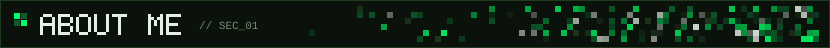

Hey, I'm Deep - a 2nd-year Computer Science student focused on building practical software, learning how things work under the hood, and turning ideas into working products.

I enjoy web development and software engineering, sharpen my problem solving with DSA, take part in hackathons, build real-world projects, and experiment with AI-powered applications.

```text
name       : Deep Panchal
github     : @deeppanchal13
status     : B.Tech Computer Science, 2nd year
direction  : Frontend / Full-Stack Development
goal       : Software Engineer who ships real products
interests  : Web Dev | Software Engineering | Problem Solving | DSA | Hackathons | AI-powered apps
```

<br>

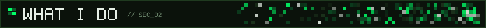

<table width="100%">
  <tr>
    <td width="33%" valign="top"><code>01</code> Building modern web applications</td>
    <td width="33%" valign="top"><code>02</code> Learning full-stack development</td>
    <td width="33%" valign="top"><code>03</code> Working with React and JavaScript</td>
  </tr>
  <tr>
    <td valign="top"><code>04</code> Practicing DSA using C++</td>
    <td valign="top"><code>05</code> Learning Python</td>
    <td valign="top"><code>06</code> Exploring AI-powered applications</td>
  </tr>
  <tr>
    <td valign="top"><code>07</code> Building real-world projects</td>
    <td valign="top"><code>08</code> Participating in hackathons</td>
    <td valign="top"><code>09</code> Improving communication and technical skills</td>
  </tr>
</table>

<br>

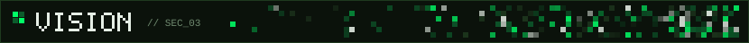

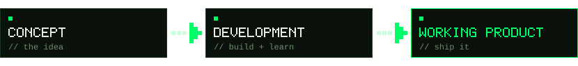

My goal is to become a strong software engineer who can take an idea from concept, through development, to a working product - and to keep getting better at the fundamentals along the way.

<br>

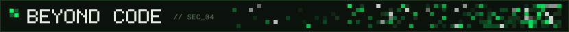

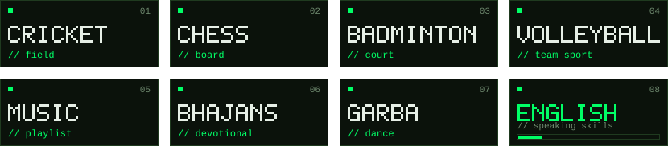

Away from the keyboard I play and follow **cricket**, **chess**, **badminton** and **volleyball**, and I like **music**. I'm also actively working on my spoken English and communication skills.

<br>

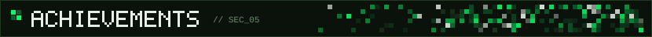

<table width="100%">
  <tr>
    <td width="50%" valign="top">
      <br>
      <b>HACK NEXUS 2025</b><br>
      <sub>Team SAGACITY</sub><br><br>
      Project: <b>Swasthya-Neeti</b> - an AI-driven public health chatbot focused on disease awareness, preventive health guidance, vaccination reminders and health alerts.
    </td>
    <td width="50%" valign="top">
      <br>
      <b>SMART INDIA HACKATHON - INTERNAL ROUND</b><br>
      <sub>College level</sub><br><br>
      Project: <b>ScholarGuru</b> - a scholarship-awareness platform that helps students discover relevant scholarship information more easily. Our team cleared the college internal SIH round.
    </td>
  </tr>
</table>

<br>

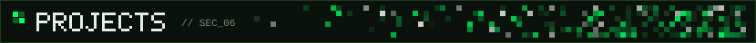

<!-- ======================= ADD LINKS ONLY IF THEY EXIST =======================
     Under any project, add a line like:
     <br><a href="https://github.com/deeppanchal13/REPO_NAME">Repo</a> | <a href="https://DEMO_URL">Demo</a>
     Never leave a fake URL in place.
     ============================================================================ -->
<table width="100%">
  <tr>
    <td width="50%" valign="top">
      <b><code>01</code> SWASTHYA-NEETI</b><br>
      AI-driven public health chatbot focused on disease awareness, preventive guidance, vaccination reminders and health alerts.<br><br>
      
      
      
      <!-- add tech tags here once you want to list the exact stack -->
    </td>
    <td width="50%" valign="top">
      <b><code>02</code> SCHOLARGURU</b><br>
      Scholarship-awareness platform designed to make scholarship information easier for students to discover.<br><br>
      
      
      
      <!-- add tech tags here once you want to list the exact stack -->
    </td>
  </tr>
  <tr>
    <td width="50%" valign="top">
      <b><code>03</code> BLOOD BANK MANAGEMENT SYSTEM</b><br>
      C++ OOP project covering donor management, recipient requests, blood stock management and blood request handling.<br><br>
      
      
    </td>
    <td width="50%" valign="top">
      <b><code>04</code> STUDENT RESULT MANAGEMENT SYSTEM</b><br>
      Python/Flask project for managing student records, marks, totals, percentages and grades.<br><br>
      
      
    </td>
  </tr>
  <tr>
    <td width="50%" valign="top">
      <b><code>05</code> NFT MINTING PLATFORM</b><br>
      Web project related to NFT minting.<br><br>
      
      
    </td>
    <td width="50%" valign="top">
      <b><code>06</code> NEXT_BUILD.exe</b><br>
      <sub>Loading... the next project goes here.</sub>
    </td>
  </tr>
</table>

<br>

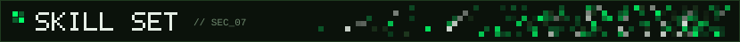

<!-- ========================= HOW TO EDIT SKILLS =========================
     Each skill is ONE <td>. To add a skill, copy a <td> and change the
     icon id (i=...) and the label. Icon ids: https://skillicons.dev
     To remove one, delete its <td>. Keep 5 <td> per <tr>.
     ======================================================================= -->
<p><sub><b>// CURRENT</b></sub></p>
<table width="100%">
  <tr>
    <td align="center" width="20%"><br><sub><b>HTML</b></sub></td>
    <td align="center" width="20%"><br><sub><b>CSS</b></sub></td>
    <td align="center" width="20%"><br><sub><b>JavaScript</b></sub></td>
    <td align="center" width="20%"><br><sub><b>React</b></sub></td>
    <td align="center" width="20%"><br><sub><b>C++</b></sub></td>
  </tr>
  <tr>
    <td align="center"><br><sub><b>Python</b></sub></td>
    <td align="center"><br><sub><b>Git</b></sub></td>
    <td align="center"><br><sub><b>GitHub</b></sub></td>
    <td align="center"><br><sub><b>Figma</b></sub></td>
    <td align="center"><br><sub><b>Postman</b></sub></td>
  </tr>
</table>

<p><sub><b>// LEARNING</b></sub></p>
<table width="100%">
  <tr>
    <td align="center" width="20%"><br><sub><b>Node.js</b></sub></td>
    <td align="center" width="20%"><br><sub><b>Express.js</b></sub></td>
    <td align="center" width="20%"><br><sub><b>MongoDB</b></sub></td>
    <td align="center" width="20%"><br><sub><b>Backend Dev</b></sub></td>
    <td align="center" width="20%">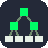<br><sub><b>DSA</b></sub></td>
  </tr>
  <tr>
    <td align="center"><br><sub><b>NumPy</b></sub></td>
    <td align="center"><br><sub><b>Pandas</b></sub></td>
    <td align="center">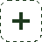<br><sub>next</sub></td>
    <td align="center"><br><sub>next</sub></td>
    <td align="center"><br><sub>next</sub></td>
  </tr>
</table>

<br>

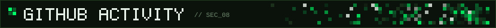

<!-- Generated by .github/workflows/profile-3d.yml from my real GitHub data (3D graph, activity radar, language donut, totals). -->
<div align="center">
  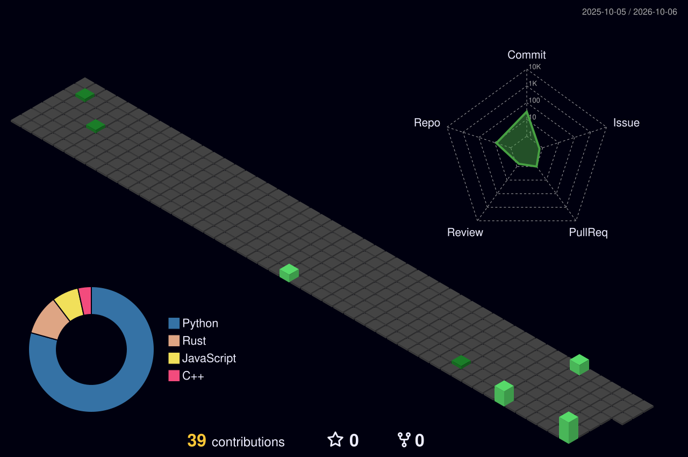
</div>

<br>

<table width="100%">
  <tr>
    <td width="50%" valign="top" align="center">
      
    </td>
    <td width="50%" valign="top" align="center">
      
    </td>
  </tr>
  <tr>
    <td width="50%" valign="top" align="center">
      
    </td>
    <td width="50%" valign="top" align="center">
      
    </td>
  </tr>
</table>

<br>

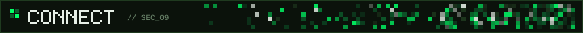

<div align="center">
  <a href="https://github.com/deeppanchal13"></a>
  <a href="https://https://www.linkedin.com/in/deep-panchal-3a1474399/"></a>
  <!-- <a href="mailto:deeppanchal13082006@gmail.com"></a> -->
  <!-- <a href="https://PORTFOLIO_PLACEHOLDER"></a> -->
</div>

<br>

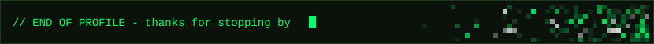
