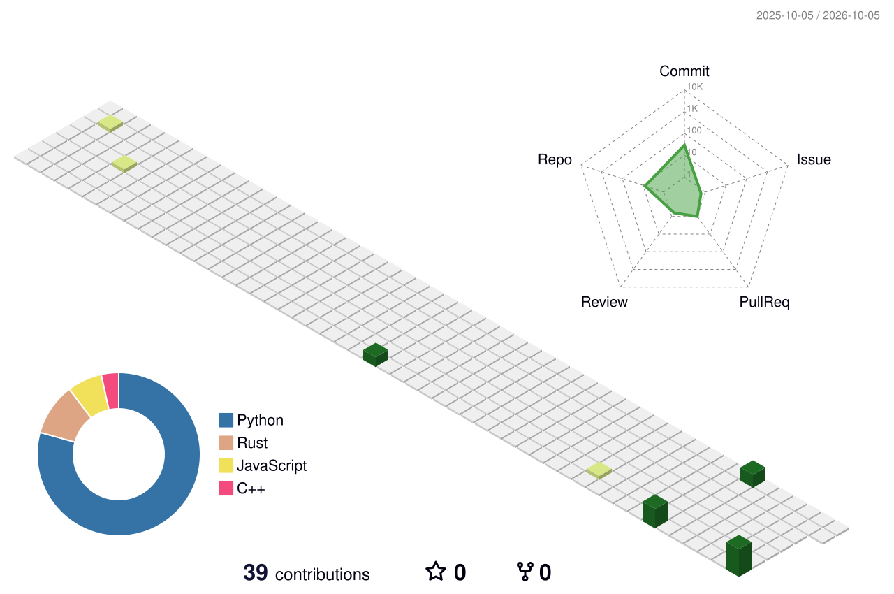

<div align="center">


<a href="https://github.com/deeppanchal13"></a>
<a href="#contact-placeholders"></a>


</div>

<table>
<tr><td width="50%" valign="top">

## `WHO_AM_I`

```text
> booting deep.panchal...
> role: 2nd-year B.Tech CSE student
> direction: frontend / full-stack development
> current mode: learn → build → iterate
```

Hey, I’m **Deep** — a 2nd-year Computer Science student focused on building practical software, learning how things work under the hood, and turning ideas into working products.

I’m interested in web development, software engineering, problem solving, DSA, hackathons, real-world projects, and AI-powered applications. I’m still learning, and that is exactly what keeps the work interesting.

</td><td width="50%" valign="top">

## `WHAT_I_DO`

```diff
+ build modern web applications
+ learn full-stack development
+ work with React and JavaScript
+ practice DSA using C++
+ learn Python and Flask
+ explore AI-powered applications
+ ship real-world projects
+ participate in hackathons
+ improve communication and technical skills
```

<p align="right"><code>concept → code → product</code></p>

</td></tr>
</table>

## `VISION.exe`

My goal is to become a strong software engineer who can take an idea from **concept → development → working product**. I’m building that ability one project, one bug, and one better question at a time.

## `BEYOND_CODE`

<table>
<tr>
<td>CRICKET</td><td>CHESS</td><td>BADMINTON</td><td>VOLLEYBALL</td>
</tr><tr>
<td>MUSIC</td><td>BHAJANS</td><td>GARBA</td><td>COMMUNICATION</td>
</tr>
</table>

When I’m away from the editor, I enjoy cricket, chess, badminton, volleyball, music, bhajans, and Garba. I’m also actively improving my spoken English and communication skills.

## `ACHIEVEMENTS.log`

<table>
<tr><td valign="top" width="50%">

### HACK NEXUS 2025

**1st Position · Team SAGACITY**

**Swasthya-Neeti** — an AI-driven public health chatbot focused on disease awareness, preventive health guidance, vaccination reminders, and health alerts.

</td><td valign="top" width="50%">

### SMART INDIA HACKATHON — INTERNAL ROUND

**Team cleared the college internal SIH round**

**ScholarGuru** — a scholarship-awareness platform designed to help students discover relevant scholarship information more easily.

</td></tr>
</table>

## `PROJECTS/`

<table>
<tr><td width="50%" valign="top">

### `01` Swasthya-Neeti
AI-driven public health chatbot for disease awareness, preventive guidance, vaccination reminders, and health alerts.

`AI` `PUBLIC HEALTH` `CHATBOT`

### `02` ScholarGuru
Scholarship-awareness platform designed to make relevant scholarship information easier for students to discover.

`WEB APP` `EDUCATION` `DISCOVERY`

### `03` Blood Bank Management System
C++ OOP project covering donor management, recipient requests, blood stock management, and blood request handling.

`C++` `OOP` `MANAGEMENT SYSTEM`

</td><td width="50%" valign="top">

### `04` Student Result Management System
Python/Flask project for student records, marks, totals, percentages, and grades.

`PYTHON` `FLASK` `CRUD`

### `05` NFT Minting Platform
Web project related to NFT minting.

`WEB3` `MINTING` `WEB PROJECT`

> Project links will be added when public repositories or demos are available. No placeholder URLs are presented as real links.

</td></tr>
</table>

## `SKILL_MATRIX`

<p align="center">
  
</p>

<table>
<tr><td><b>USING</b></td><td>HTML · CSS · JavaScript · React · C++ · Python · Git · GitHub · Figma · Postman</td></tr>
<tr><td><b>LEARNING</b></td><td>Node.js · Express.js · MongoDB · Backend Development · DSA · NumPy · Pandas</td></tr>
</table>

<details>
<summary><code>skill_notes.txt</code></summary>

The icon row is intentionally easy to edit: update the comma-separated `i=` list and the two text rows above as your skills change. These labels describe what I’m using or learning, not a claim of advanced expertise.

</details>

## `GITHUB_ACTIVITY`

<p align="center">
  
</p>

<p align="center"><sub>The 3D contribution view above is generated from real GitHub activity by the scheduled workflow in <code>.github/workflows/profile-3d.yml</code>. Run it once manually after adding this repository so the SVG is created.</sub></p>

<table>
<tr><td width="50%"></td><td width="50%"></td></tr>
<tr><td></td><td></td></tr>
</table>

<p align="center"><sub>Stats, streak, languages, and activity are fetched dynamically. If a third-party card is temporarily rate-limited, the local contribution SVG remains the source-controlled activity view.</sub></p>

## `CONTACT_PLACEHOLDERS`

<table>
<tr><td align="center"><a href="https://github.com/deeppanchal13"><br /><sub>GitHub</sub></a></td>
<td align="center"><a href="#contact-placeholders"><br /><sub>LinkedIn — add URL</sub></a></td>
<td align="center"><a href="#contact-placeholders"><br /><sub>Gmail — add email</sub></a></td>
<td align="center"><a href="#contact-placeholders"><br /><sub>Portfolio — add URL</sub></a></td></tr>
</table>

Replace the three placeholder tiles above when the details are ready. The GitHub link is the only external contact link included because it was provided explicitly.

<div align="center">

`[ learn in public ]` · `[ build with purpose ]` · `[ keep improving ]`

<sub>Designed as a personal developer dashboard — original identity, real activity, editable source.</sub>

</div>
